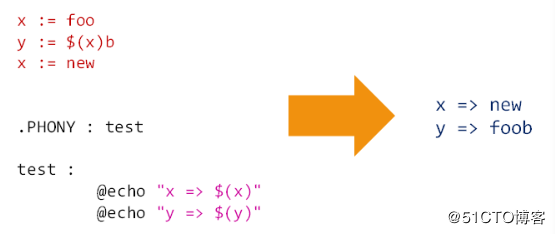
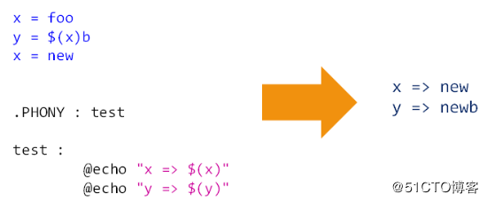
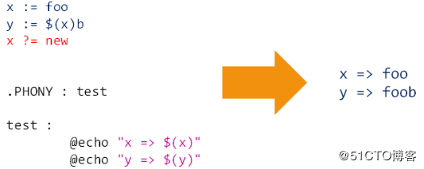
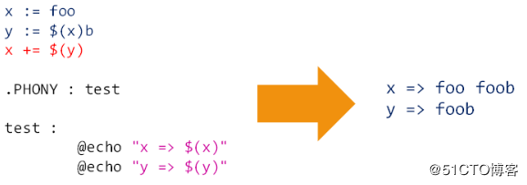
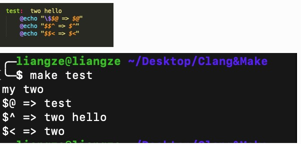
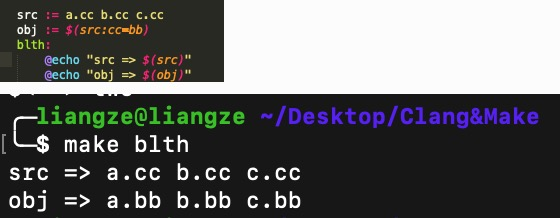
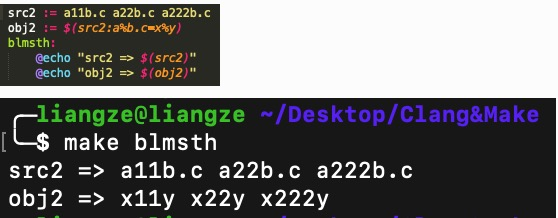
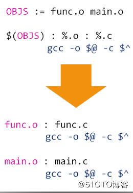
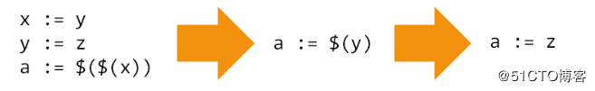
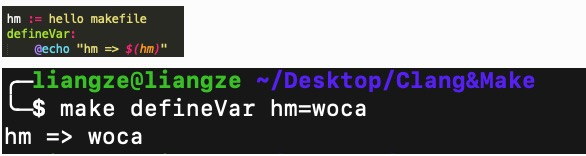

# 0x00 make简介
[blog](https://blog.csdn.net/seven_amber/article/details/70216216)
- make是一个指令工具，它解释makefile中的指令或者说规则。在我们执行make之前，需要有一个名为makefile或Makefile的文件。这个文件用来告诉make需要完成什么样的操作。我们可以简单的把makefile认为是一份定义了源文件间依赖关系、如何编译各个源文件并生成可执行文件的说明书。
- makefile的基本结构如下
  ```
  TARGET... : PREREQUISITES...
    COMMAND
    ...
  ```
  - TARGET：规则的目标，最终生成文件的名字或者是中间过程文件名，也可以是make执行的动作的名称。
  - PREREQUISITES：规则的依赖，生成目标所必须的文件名列表。
  - COMMAND：规则的命令。规则需要执行的动作
  - 注意：这里需要注意的是，命令前面使用的是TAB键，而不是空格，使用空格会出现错误。

#0x04 伪目标
- 由于在makefile中，make在默认情况下将目标当作是一个文件来处理，所以这里就会出现一个情况，如果makefile中的目标是实际已经存在的文件，那么，我们在使用makefile的时候，就会报错。比如执行如下命令时 (make hello) 当前文件还有一个名为hello的文件,刚会提示 make: `hello' is up to date.
  ```
  hello: 
	echo "hello makefile"
  ```
- 为了避免这种情况的出现，就引入了伪目标的概念。此时，哪怕当前目录下已经存在了一个名为hello的文件，make仍然会去执行hello目标下的命令。
  ```
  .PHONY: hello
  hello: 
	echo "hello makefile"
  ```
  or
  ```
  hello: FORCE
	echo "hello makefile"
  FORCE:
  ```

# 0x08 在makefile中，支持程序设计语言中变量的概念，所有的变量只代表文本数据。 变量的赋值方式:
1.  简单赋值 := ;  只针对当前语句的变量有效 
2.  递归赋值  = ;  赋值操作可能影响多个其他变量，所有与目标变量相关的其他变量都将受到影响 
3.  条件赋值 ?= ;  如果变量未定义，使用赋值符号中的值定义变量，如果已定义，赋值无效 
4.  追加赋值 += ;  原变量值之后加上一个新值，原变量值和新值之间由空格隔开 

# 0x0c 预定义变量
1. 自动变量
  - $@ 当前规则中触发命令被执行的目标
  - $^ 当前规则中的所有依赖 
  - $< 当前规则中的第一个依赖
  
2. 特殊变量 这部分根据需要再去查询make手册
  
# 0x10 变量的高级用法
1. 变量值的替换；使用指定字符替换变量值中的后缀字符; 语法格式：$(var:a=b)或${var:a=b} 
2. 变量的模式替换; 使用%保留变量值中的指定字符，替换其他字符; 语法格式：语法格式："\$(var:a%b=x%y)或${var:a%b=x%y}" 
3. 规则中的模式替换
   ```
   targets: target-pattern : prerequ-pattern
        command1
        command2
        ......
   ```
   意义: 
   通过target-pattern从targets中匹配子目标；
   再通过prereq-pattern从子目标生成依赖；进而构成完全整的规则
   
4. 变量的嵌套引用；一个变量名之中可以包含对其他变量的引用; 嵌套引用的本质是使用一个变量表示另外一个变量; 
5. 运行make时，在命令行定义变量;命令行变量默认覆盖makefile中定义的变量; 
使用override关键字以后，makefile中定义的变量不会因为make的命令行变量而改变
6. define关键字; 定义多行变量时，使用define关键字，同时可以配合override关键字防止变量被覆盖; define定义的变量等价于使用=定义的变量
7. 环境变量是操作系统本身的变量，makefile可以直接使用这些变量，但如果在makefile中定义了同名变量，那么将在当前的makefile中覆盖环境变量。运行make时。指定-e选项，可以优先使用环境变量
8. 变量在不同makefile之间的传递方式
   - 直接在外部定义环境变量进行传递
   - 使用export定义变量进行传递
   - 定义make命令行变量进行传递   
9. 目标变量; 作用域只在指定目标及连带规则中
   ```
   test : var := test-var
   %e : override new := test-new
   ```
10. 模式变量; 模式变量是目标变量的扩展，可以根据相应的规则，找到符合规则的目标

# 0x14 函数调用
1. 自定义函数；
    - 自定义函数是一个多行变量，无法直接调用
    - 自定义函数是一个过程调用，没有任何返回值 
    - 自定义函数用于定义命令集合，并应用规则中
    - 通常，调用自定义的方法是在规则中，$(call funcname)，这种方式调用。当我们用var的方式去调用函数时，不会成功的调用函数，原因就在于，define定义的函数，必须要在规则中通过call才能调用，否则，就只是当作一个变量。call的作用，就是将相应的位置换成实参。
2. 预定义函数。 预定义函数一般需要使用的时候再去查询； 在makefile中不支持真正意义上的函数，因为自定义函数只是一个多行变量；预定义的call函数在调用时，将参数传递给多行变量；自定义函数是call函数的实参，并在call中被执行。
3. makefile中的函数（都是有返回值）
   - wildcard 查找当前目录下所有.c文件，返回值给src;src=$(wildcard ./*.c)
   - patsubst 替换所有.c文件为.o文件; obj=$(patsubst ./%.c, ./%.o, $(src))
  
# 0x18 条件判断
<conditional-directive> //ifeq ($(CC),gcc) //ifneq //ifdef<variable-name> // ifndef <variable-name>
<text-if-true> //$(CC) -o foo $(objects) $(libs_for_gcc)
else
<text-if-false> //$(CC) -o foo $(objects) $(normal_libs)
endif